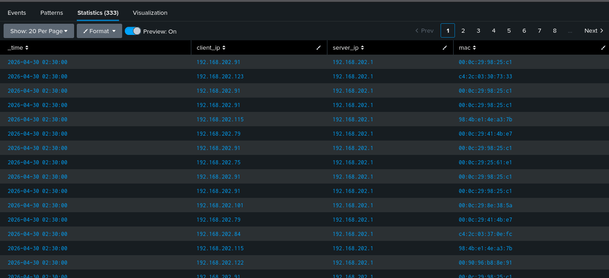

# DHCP Log Analysis & Visibility Engineering Using Splunk

##  Overview
This project focuses on ingesting, parsing, and normalizing DHCP logs from Zeek within Splunk to build structured visibility for detection engineering.

---

## Objective
To transform raw DHCP logs into structured, queryable data and establish baseline network behavior.

---

##  Lab Setup

- **Log Source:** Zeek (`dhcp.log`)
- **SIEM:** Splunk
- **Environment:** Virtual Lab (Kali Linux + VirtualBox)

---

## Log Source

The dataset used is Zeek DHCP logs containing:

- Client IP addresses  
- DHCP server IP  
- MAC addresses  
- Lease activity  

---

##  Methodology

### 1. Log Ingestion

- Uploaded `dhcp.log` into Splunk  
- Assigned custom sourcetype: `zeek_dhcp`  
- Configured event breaking (line-by-line)  

---

### 2. Field Extraction

Used regex (`rex`) to extract structured fields from raw logs:

```spl
index=main sourcetype=zeek_dhcp
| rex field=_raw "(?<ts>\d+\.\d+)\s+(?<uid>\S+)\s+(?<client_ip>\d+\.\d+\.\d+\.\d+)\s+(?<client_port>\d+)\s+(?<server_ip>\d+\.\d+\.\d+\.\d+)\s+(?<server_port>\d+)\s+(?<mac>[0-9a-f:]{17})"
| table _time client_ip server_ip mac
```
---

### 3. Data Normalization

- Converted unstructured logs into structured fields  
- Ensured accuracy of:
  - IP address formats  
  - MAC address formats  
- Removed parsing errors caused by field misalignment  

---

##  Analysis & Findings

### Baseline Observations

- Single DHCP server observed: `192.168.202.1`  
- Multiple clients receiving IP leases  
- Consistent MAC-to-IP mapping patterns  

---

##  Sample Output



---

##  SOC Insight

Accurate field extraction is critical in SIEM environments.

Improper parsing can result in:
- false positives  
- missed detections  
- incorrect threat analysis  

---

##  Key Takeaway

Detection engineering starts with clean and validated data.

Without proper normalization, detection logic becomes unreliable.

---
  
##  Next Steps

- Detect rogue DHCP servers  
- Identify abnormal IP assignment patterns  
- Correlate DHCP with DNS and network traffic logs  

---

##  Tags

`Splunk` `Zeek` `DHCP` `Detection Engineering` `SOC Analyst` `Threat Hunting`
